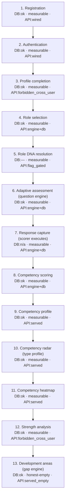

# MX-301A — Assessment Journey Flow Diagram

Candidate `user_4286d980cc6cc038` traversal. Each node carries its validated lenses (DB / Engine / API verdict).

**Legend:** `served`=authed 200 · `served_empty`=authed 404 honest no-data (route wired) ·
`wired`=gated unauth · `flag_gated`=503 (flag OFF) · `forbidden_cross_user`=403 self-scoped ·
`broken`=route missing (404/000 unauth). `honest-empty`=structurally wired, no measurable input
for this candidate (not a failure).
