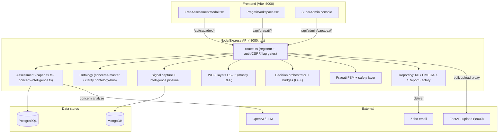
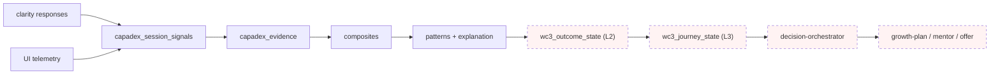
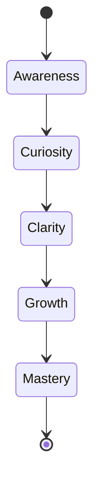
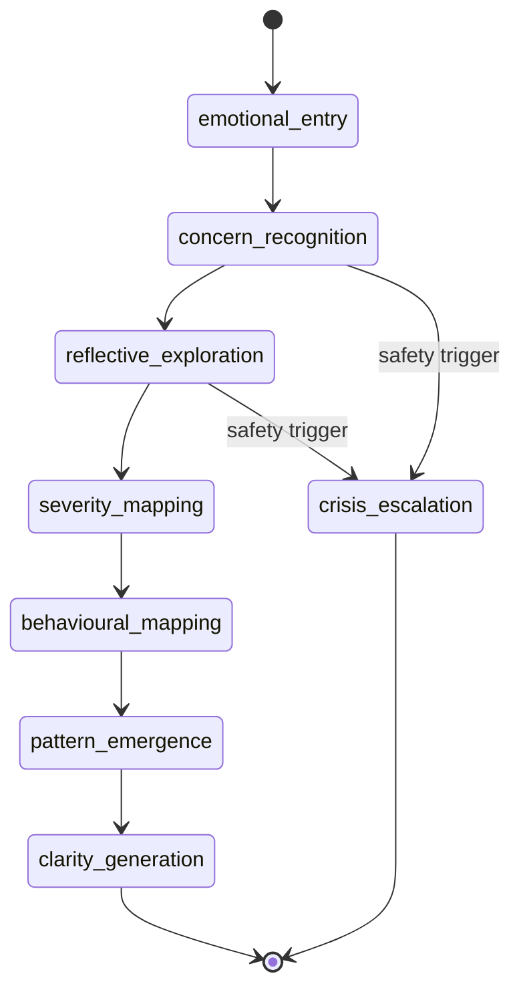

# CAPADEX — End-to-End Document

> **Read-only reference. No code modified.** A single, self-contained walkthrough of CAPADEX from
> top to bottom: what it is, the live user journey, the architecture, the data model, every subsystem
> (live *and* dormant), the decision engine, reporting, AI, safety, and the current-vs-target gap.
>
> **Honesty contract** (applies throughout): *real ≠ scaffolded*, *null ≠ 0*, *built ≠ activated*.
> Where a thing exists in code but is switched off, it is labelled **DORMANT (flag-OFF)**; where it is
> never wired to a request path, **OFFLINE**. Verified facts are drawn from `backend/routes.ts`, the
> feature-flag registry, migrations, and service code.
>
> **Companion docs:** `docs/CAPADEX.md` (the consolidated product/runtime/API single-source-of-truth);
> MX-700 phase deliverables `phase-1-current-state-discovery.md`, `phase-2-business-model-audit.md`,
> `phase-3-global-research-benchmarking.md` (same folder). This document stitches them into one
> end-to-end narrative.

---

## Table of contents
1. What CAPADEX is (one paragraph)
2. The end-to-end user journey (live)
3. System architecture
4. The eight subsystems (the layered stack)
5. Data model — end to end
6. Runtime flow — stage by stage
7. The behavioural ontology (the moat)
8. Adaptive logic
9. Stage & progression model
10. Pragati conversational runtime
11. The decision engine (built but OFF)
12. Reporting & commercial
13. AI usage & graceful degradation
14. Personas & routing
15. Safety, governance & compliance
16. Feature-flag posture
17. Current state vs MX-700 target (the gap)
18. Known traps & gotchas (consolidated)
19. Glossary
20. Appendix — file / route / table index

---

## 1. What CAPADEX is

CAPADEX is MetryxOne's **behavioural-intelligence front door**: a free/low-cost diagnostic where a user
describes a *concern* in their own words, answers a short set of adaptive *clarity questions*, and receives
a behavioural readout — a **0–100 score, a level band, a sub-domain heatmap, pattern tags, and a report**.
It is intended as the **top-of-funnel** into the paid products (Career Builder, LBI, mentoring,
subscriptions). Strategically (initiative **MX-700**), the goal is to promote CAPADEX from *"a diagnostic
that produces a report"* to *"an adaptive decision engine that guides every user."* The machinery for that
promotion **already exists in code but is shipped OFF** — so the work ahead is largely **activate +
reconcile + make-explainable**, not build-from-scratch.

---

## 2. The end-to-end user journey (live)

What a real user experiences today, start to finish:

```
1. INTRO       User opens the assessment (FreeAssessmentModal). Picks persona/age, types a concern in free text.
2. ANALYZE     System resolves the free text → a canonical concern (AI if available, deterministic fallback otherwise)
               and runs a safety scan (crisis/distress language → escalation/supportive reframing).
3. CLARIFY     A 3-tier picker selects diagnostic "clarity questions" matched to the concern (by bridge tag),
               filtered by persona (soft) + age (hard).
4. PREVIEW     User sees what the assessment will explore (preview shares ONE visual canon with the final report).
5. QUESTIONS   User answers clarity questions one at a time. After each answer the adaptive engine decides the
               next move (escalate / de-escalate / consistency-probe / deepen). Signals are captured per response.
6. RESULT      On completion the system scores 0–100, assigns a level band, builds a sub-domain heatmap and
               pattern tags, and shows a result card.
7. REGISTER    To unlock the full report the user registers (email) and verifies via OTP.
8. REPORT      Entitlement-gated full report (+ optional OMEGA-X quality read, + PDF). Delivered in-app and,
               when Zoho is configured, by email.
   ─────────────────────────────────────────────────────────────────────────────────────────────────────────
   [DORMANT]    The intended next step — outcome projection → journey → decision → next-best-action hand-off to
               growth-plan / mentor / offer — is BUILT BUT FLAG-OFF. Today the journey ends at the report.
```

### Live sequence
```mermaid
sequenceDiagram
  participant U as User
  participant FE as FreeAssessmentModal
  participant API as Node API (:8080)
  participant LLM as OpenAI (optional)
  participant DB as PostgreSQL
  U->>FE: describe concern (free text + age + persona)
  FE->>API: POST /concern/analyze
  API->>LLM: resolve concern → canonical id
  alt LLM unavailable
    API->>API: resolveCapadexConcern (regex/IDF fallback)
  end
  API->>API: safety scan (crisis / distress)
  API-->>FE: resolved concern + clarity preview
  FE->>API: POST /session/start
  API->>DB: create capadex_session
  loop each clarity question
    FE->>API: POST /session/:id/respond
    API->>DB: persist response (+ signal capture)
    API->>API: adaptive decideNext (escalate / de-escalate / probe / deepen)
    API-->>FE: next question
  end
  FE->>API: POST /session/:id/complete
  API->>DB: score (0–100) + level band + heatmap + patterns
  API-->>FE: result card
  FE->>API: GET /session/:id/report (entitlement-gated)
  API->>DB: read report; Zoho email if configured
  API-->>FE: full report
```

---

## 3. System architecture

**Three runtime processes:**
- **Node/Express API** (`backend/`, **port 8080**) — the CAPADEX brain: every assessment, ontology,
  intelligence, decision, Pragati, and reporting route. Runs on `tsx` (**no compile/typecheck gate in
  prod** — the only real launch gate is the frontend Vite build).
- **FastAPI upload service** (`backend-main/`, **port 8000**) — bulk upload / heavy ingest; the Node API
  proxies to it via `FASTAPI_URL`.
- **React/Vite frontend** (`frontend/`, **port 5000**) — the assessment modal, Pragati workspace, and
  SuperAdmin console; `/api/*` is proxied to 8080.

**Data stores & externals:**
- **PostgreSQL** (`DATABASE_URL`) — source of truth for all session state and scores.
- **MongoDB** (`MONGODB_URI`) — high-volume telemetry/signals (fire-and-forget, non-blocking).
- **OpenAI/LLM** — concern analysis + narrative; **degrades to deterministic regex/IDF + static** when absent.
- **Zoho** — report/OTP email; **degrades to in-app retrieval** when absent.



---

## 4. The eight subsystems (the layered stack)

CAPADEX is **not one product** — it is a layered stack of ~8 subsystems that grew additively, each behind
its own flag:

| # | Subsystem | Role | Status |
|---|---|---|---|
| 1 | **Assessment runtime** | concern → clarity → score → report (the revenue core) | **LIVE** |
| 2 | **Behavioural ontology** | 4-tier signals (~16k atomic) + concerns master (~2.5k) + clarity (~30k) | **LIVE (data)** |
| 3 | **Runtime intelligence spine** | signal → evidence → composite → pattern → explanation | **DORMANT (flag-OFF)** |
| 4 | **WC-3 intelligence layers** | L1 Stage · L2 Outcome · L3 Journey · L4 Personalization · L5A–D projections · longitudinal | **MOSTLY OFF / OFFLINE** |
| 5 | **Decision orchestration** | WC-6/WC-7B composer + bridges to growth-plan / mentor / offer | **DORMANT (flag-OFF)** |
| 6 | **Pragati** | 13-state conversational FSM + crisis/safety layer | **LIVE** |
| 7 | **PIL** | Problem Intelligence Layer + knowledge graph (`pil_kg_*`) | **Flag-gated** |
| 8 | **Reporting / commercial** | Assessment report, OMEGA-X, 6C, Report Factory, entitlement/metering | **Mixed (reports live, commerce OFF)** |

**Defining characteristic:** the *substrate is rich and largely real*, but the *intelligence and decision
layers are dormant*. What runs live for a normal user is essentially **concern → clarity → score → report**.

---

## 5. Data model — end to end

### 5.1 Runtime spine (per-session execution chain)
```
capadex_session_signals → capadex_evidence → capadex_session_composites
   → capadex_session_patterns → wc3_outcome_state → wc3_journey_state
```
| Table | Purpose | Status |
|---|---|---|
| `capadex_sessions` / `_responses` / `_users` / `_otps` / `_reports` / `_runtime_sessions` | Live session state, answers, users, OTP, reports | **Real / dynamic** |
| `capadex_session_signals` (`session_id` uuid) | Captured per-session signals | Dynamic |
| `capadex_evidence` | Normalised evidence from answers/telemetry | Dynamic |
| `capadex_session_composites` | Higher-order composite signals | Dynamic (pipeline flag) |
| `capadex_session_patterns` | Explainable patterns (signal_refs / composite_refs / explanation) | Dynamic (pipeline flag) |
| `wc3_stage_state` / `wc3_outcome_state` / `wc3_journey_state` | WC-3 L1/L2/L3 per-session state | Dynamic **only when flags ON (OFF today)** |

### 5.2 Configuration / ontology (reference data)
| Table | Purpose | Status |
|---|---|---|
| `capadex_concerns_master` (~2.5k) | Authoritative concern taxonomy; **`relational_bridge_tag` is the join key** | Real, populated |
| `capadex_clarity_questions` (~30k) | Diagnostic item pool; joins via **`master_bridge_tag` (bucket-level)**; ⚠️ `concern_id` is **DISJOINT** from master | Real, populated |
| `capadex_domains/families/signals/atomic_signals` (4-tier, ~16k atomic) | Signal ontology | Real, populated |
| `wc3_stage_definitions` (5) / `wc3_outcome_models` (6–7) / `wc3_journey_routes` (5) | Seeded catalogs | Real (seeded) |
| `onto_domains/families/competencies/roles/dna_profiles/role_weights` | Competency genome + Role-DNA | Real (curated + O*NET-derived) |
| `pil_kg_*` | Problem Intelligence knowledge graph | Flag-gated — ⚠️ namespace `pil_kg_*` **NEVER** bare `kg_*` (collision wipes the live Employability graph) |

**Schema management:** no central migration runner — most tables have a migration file **AND** a lazy
`ensure*Schema()` (`CREATE TABLE IF NOT EXISTS`) that mirrors it. **Existence ≠ population.**

**Two distinct flag systems (honesty trap):** the file registry `config/feature-flags.ts` (gates
routes/UI) **AND** a DB table `feature_flags` (gates `/api/signals/ingest` + engine flags). If signal
tables look empty, check the DB table first.

### 5.3 The data flow (most downstream is OFF)

> Pink/dashed = **flag-OFF or offline today**. The live path stops at `patterns`.

---

## 6. Runtime flow — stage by stage

| Stage | What happens | Code surface | Status |
|---|---|---|---|
| **Intake** | persona/age + free-text concern | `FreeAssessmentModal.tsx` | Live |
| **Resolve** | free text → canonical concern via IDF-weighted cascade; LLM optional | `concern-resolver-engine.ts` + `resolveCapadexConcern()` (two resolvers — see traps) | Live |
| **Safety** | crisis/distress scan → escalation / supportive reframing | `safety-layer.ts` | Live |
| **Clarify** | 3-tier picker `pickQuestionsFromMaster → pickQuestionsFromDB → static`; persona soft + age hard | `routes/capadex.ts` | Live |
| **Adapt** | per-answer `decideNext` (escalate/de-escalate/probe/deepen) | `adaptive-assessment-engine.ts` | Live |
| **Capture** | persist response + emit signals/telemetry | `signal-capture.ts` | Live (capture) / pipeline gated |
| **Score** | 0–100 + level band + sub-domain heatmap + pattern tags | `routes/capadex.ts` complete handler | Live |
| **Report** | entitlement-gated full report + OMEGA-X + PDF + email | `pil/report-builder.ts`, `email.ts` | Live |
| **Outcome → Journey → Decision → NBA** | project outcome, route journey, compose decision, fan to destinations | `wc3/*`, `wc7b/decision-orchestrator.ts`, bridges | **DORMANT (flag-OFF)** |

---

## 7. The behavioural ontology (the moat)

The proprietary asset. **Four tiers:** `domains (20) → families (400) → signals (20) → atomic (~16k)`,
plus a **concerns master (~2.5k)** and a **clarity-question pool (~30k)**.

- **Join integrity is the #1 data risk.** Clarity questions join to concerns **only** via
  `master_bridge_tag` (bucket-level). `concern_id` on clarity rows is **disjoint** from `concerns_master`
  (0% join). Inherited age/persona/dev-stage on clarity rows are **ambiguous** and must be recovered via
  the **bridge tag**, not `concern_cluster`.
- **Atomic "unmapped" bucket is mostly POSITIVE strengths** — that is correct, not a bug. Remap only the
  *negative* catch-all via hand-verified family maps; never fabricate.
- **Strengths canon:** strengths come ONLY from CSI `positive_factors` / positive longitudinal growth —
  **never** from raw concern-signal magnitude (signals are concern-*diagnostic*).
- Admin curation: `SignalOntologyHubPanel`, `CapadexConcernsMasterPanel`, `CapadexClarityQuestionsPanel`.

---

## 8. Adaptive logic

`adaptive-assessment-engine.ts decideNext()`:
- **Consistency probe** when `contradiction_count ≥ 2`.
- **De-escalate** difficulty when `rolling_confidence < 0.45`.
- **Escalate** when `streak_high ≥ 3` and `rolling_score ≥ 80`.
- **Depth expansion** (e.g. Leadership): `rolling_score ≥ 75` → `depth_band standard → deep`.

> **Honest ceiling:** the live served clarity bank is **~100% "medium"** difficulty, so *served* difficulty
> cannot actually shift even when the engine decides to escalate — the target/readiness thresholds move,
> the item difficulty does not. **This is an authoring gap, not a logic bug**, and it is why "adaptive"
> is not visible to users today. (Phase 3 P5: real CAT/IRT adaptivity requires authoring a difficulty range first.)

---

## 9. Stage & progression model

- **Canonical 5-stage (WC-3 L1):** Awareness(0.25) → Curiosity(0.50) → Clarity(0.75) → Growth(1.00) →
  Mastery(1.25). `resolveSessionStage = 0.6·stage_code + 0.4·CSI`.
- **THE core debt — three overlapping taxonomies:** 5-stage (backend), 4-code `CAP_*` (frontend),
  3-stage (older report pages). **They must be reconciled to ONE axis before any user-facing decision is
  keyed to stage.**
- **Question-level stage (L5A)** is *derived* (the `stage` column is dead) by weighted vote over
  `question_type` / `response_type` / `narrative_style` / `polarity`; it legitimately skews
  Clarity(~56%) / Growth(~30%), Mastery rare (~0.4%) — an authoring property, not a bug.
- **Orthogonality (Phase 3 §7):** behavioural-mastery stage and career-experience stage are **two
  separate axes** and must never be composited.



---

## 10. Pragati conversational runtime

An alternative, empathetic intake surface: a **13-state FSM**, 8 block types, a 12-concern ontology,
adaptive density, a 4-dimension quality score, deterministic fallback, and a **crisis-escalation + safety
middleware** (duty of care is non-negotiable). Backend `routes/pragati.ts`; frontend
`PragatiWorkspace.tsx` (3-panel). It is the best in-house template for the MX-700 *continuous-guidance*
conversational loop.



---

## 11. The decision engine (built but OFF)

This is the heart of the MX-700 vision — **and it already exists in code, switched off**:

- **WC-3 chain:** L2 Outcome projection (`wc3/outcome-intelligence.ts`), L3 Journey projection
  (`journey-projection.ts`), plus L4 personalization and longitudinal/trend layers.
- **Decision orchestrator** (`wc7b/decision-orchestrator.ts`): composes an *activation envelope* and is
  meant to fan one decision out to destinations.
- **Bridges:** `growth-plan-bridge.ts` (the growth plan already lives in M5 — wire, don't rebuild),
  `mentor-bridge.ts`, `wc7c/offer-engine.ts`, and `decision-persistence.ts`.
- **Endpoints:** `GET /api/capadex/session/:id/activation` (orchestrator), `/outcome`, `/journey` — all
  behind `decisionOrchestrator` / `wc3Outcome` / `wc3Journey`, **all OFF**.

> **The single most important finding across the whole initiative:** *"CAPADEX as a decision engine" is
> already coded but shipped OFF.* Re-architecture ≈ **activate + reconcile + make-explainable**, behind
> the same flag discipline — not a green-field rebuild. ⚠️ The outcome chain also depends on a *populated
> behavioural spine* (`FF_WC3_OUTCOME_CROSSWALK`), so activation must verify data, not just flip flags.

---

## 12. Reporting & commercial

| System | Output | Status |
|---|---|---|
| **Assessment report** | 0–100, level band (Emerging/Developing/Proficient/Advanced), sub-domain heatmap, pattern tags; free result card → entitlement-gated full report → PDF | **LIVE** |
| **OMEGA-X** | Report quality/validation score (completeness, consistency, anchor alignment, contradiction detection) | Live (paid) |
| **Dynamic Report Intelligence (6C)** | Stakeholder reports across 6 quality axes | Flag-gated (OFF) |
| **Report Factory** | Admin template/narrative engine, white-label export (pdfkit, `/tmp/rf_exports`) | Flag-gated; zero rows in dev = honest |
| **Commercial spine** | entitlement / metering / recurring / upsell / renewal / invoice-GST | **Entire family flag-OFF**; no decision→package mapping yet |

- **Preview ↔ report share ONE visual canon** (hopeful/light tone; header/CTA deep enough for white text).
- **Email:** Zoho; `X-Preview-Subject` header must be `encodeURIComponent` (ASCII-only headers); all
  user/AI-authored interpolation is HTML-escaped (XSS).
- **Ledger of record** = `capadex_payments` (paid rows only). Commerce reads **fail closed**.

---

## 13. AI usage & graceful degradation

CAPADEX uses AI as an **enrichment layer on a deterministic spine** (which is exactly the world-class
pattern from Phase 3, P3). Three layers:
1. **Deterministic core** — scoring, IDF concern resolver, decision composer. Reproducible, auditable.
2. **ML inference** — *currently absent* (Phase 3's biggest capability gap: infer adjacency/learnability).
3. **LLM narration** — concern analysis, Pragati reflections, report narrative.

| Dependency | Used for | Degradation when absent |
|---|---|---|
| **PostgreSQL** | all session state + scores | **Hard stop** — assessment cannot proceed |
| **OpenAI / LLM** | concern analysis, narrative, Pragati | falls back to regex/IDF resolver + static templates; AI paths emit **null (never 0)** |
| **MongoDB** | telemetry / signal volume | bypassed (fire-and-forget); scores unaffected |
| **Zoho** | report + OTP email | reports stay in "My Sessions"; dev MFA code logged to workflow console |
| **FastAPI (:8000)** | bulk upload | uploads fail; assessment unaffected |

---

## 14. Personas & routing

- **Personas:** student, adult, parent (assessment side); employer, recruiter, mentor, institution (ecosystem side).
- **Detection:** platform `role` primary; `experience-routing.ts deriveStage()` refines via `yearsExp`,
  seniority regex ("VP"/"Chief"), work-experience presence → career stages.
- **Routing:** `effectiveExperience` sends users to Launchpad (fresher) / Command Center (mid) /
  Leadership-Executive Studio (senior). **The experience switch is a navigation PREFERENCE — it must
  never mutate the canonical stage** (else junior escalates / senior silently demotes).
- **Assessment-side age/persona routing:** persona is **SOFT** (~63% provider-only families), age is
  **HARD** (`age_min`/`age_max`). Derive adultness from **age (≥24)**, not the persona key alone, or
  empty-persona adults mis-route to student banks.

---

## 15. Safety, governance & compliance

- **Safety/crisis (Pragati + assessment):** `safety-layer.ts validateNarrative()` — REFERRAL (self-harm
  language → counsellor escalation), SUPPORTIVE (distress → reframing), shame-language sanitization,
  diagnostic-label removal.
- **Language policy:** outputs are **developmental signals only — NEVER hiring/promotion/suitability
  predictions**; every envelope ships allowed/disallowed term lists.
- **k-anonymity:** peer benchmarks suppressed below `k_min=30`; cohort responses aggregate-only.
- **Append-only history** for competency/history tables (never mutated in place).
- **Auth:** admin APIs are `requireAuth` + `requireSuperAdmin`; super-admin login is **always 2FA-gated**
  (no password-only path); CSRF is global double-submit (mounted first; fail-closed); auth endpoints are
  rate-limited; audit logs are redacted at write time.
- **PII discipline:** audit/measure artifacts mask user emails to irreversible pseudonyms before writing.

---

## 16. Feature-flag posture

- **Default ON (file registry):** `adaptiveQuestioning`, `validationLoop`, `memoryIntelligence`, the
  `*V2` competency/runtime cluster, `ucipEnabled/ShadowMode`, `adaptiveIntelligenceFoundation`,
  `employabilityPassport`, `careerBuilderSuite`, `careerOutcomeEvidence`.
- **Default OFF (the whole decision/intelligence frontier):** `wc3Stage/Outcome/Journey/Personalization/
  Longitudinal/QuestionIntel/ContextIntel/OutcomeCrosswalk`, `decisionOrchestrator`,
  `journeyGrowthPlanBridge`, `decisionMentorBridge`, `decisionPersistence`,
  `runtimeIntelligenceActivation/Pipeline/Consumption`, `outcomeIntelligenceActivation`,
  `forecastIntelligence`, `interventionIntelligence`, `careerIntelligence*`, the whole `commercial*` family.
- **170 flags total** in the registry; **~60–70 `FF_*` are turned ON via the Backend API workflow env**,
  so the **live dev posture ≠ file-registry defaults** — any "what's activated" claim must be measured
  against the **live workflow env**, not the file.

---

## 17. Current state vs MX-700 target (the gap)

| Dimension | Today | MX-700 target | What it takes |
|---|---|---|---|
| **Output** | a report | a **decision + next-best-action** | activate decision orchestrator + bridges |
| **Adaptivity** | flat-difficulty bank → invisible | psychometric (CAT/IRT-style) | author a real difficulty range, then item-info selection |
| **Inference** | additive scoring of answers | infer **adjacency + learnability** | add an ML inference layer (graph-based) |
| **Ontology** | 4-tier tree + disjoint joins | one living **graph** | unify tiers + PIL KG; fix the `concern_id`/`bridge_tag` join |
| **Guidance** | one-shot, ends at report | **continuous** loop | activate longitudinal/memory; reuse Pragati FSM |
| **Explainability** | explainer exists, internal | reasons + counterfactuals on **every** rec | unify the ~11 recommendation modules behind one NBA ranker with a trace |
| **Stage model** | 3 conflicting taxonomies | ONE behavioural-mastery axis | reconcile (Phase 2 §2) |
| **Engine sprawl** | ~11 rec / ~7 orchestrators / ~6 resolvers / ~4 memory | one of each | consolidate (Phase 2 §2 — biggest debt lever) |

> **Net:** the re-architecture is **~70% activation/reconciliation of dormant code, ~30% net-new**
> (the ML inference layer + authored difficulty range + the continuous loop). Everything stays flag-gated;
> flag-OFF must remain byte-identical to legacy.

---

## 18. Known traps & gotchas (consolidated)

- **Two concern resolvers** (`concern-resolver-engine.ts` + `resolveCapadexConcern()` in `routes/capadex.ts`)
  can diverge → merge to one shared resolver.
- **Two flag systems** (file registry + DB `feature_flags`) → "is X on?" has two answers.
- **`concern_id` ⟂ `concerns_master`** — only `master_bridge_tag` joins; recover age/persona via bridge tag.
- **Flat-difficulty bank** caps real adaptivity (authoring gap).
- **`pil_kg_*` namespace** — NEVER bare `kg_*` (would wipe the live Employability graph).
- **Express route order** — register literal sub-paths (`/complete`, `/export.csv`) **before** `/:id`.
- **New backend route → restart Backend API** before smoke-testing (`Cannot GET` otherwise).
- **`routes.ts` is 14,464 lines** / `CareerBuilderPage.tsx` 8,754 / `FreeAssessmentModal.tsx` 3,169 — split candidates.
- **Existence ≠ population** — ontology auto-creates via `ensureSignalOntologySchema` but still needs seeding.
- **Merged task data backfills don't reach the live shared DB** — verify activation by querying the shared DB.
- **Backend runs on `tsx`** — no typecheck gate; the frontend Vite build is the only real launch gate.

---

## 19. Glossary

| Term | Meaning |
|---|---|
| **Concern** | the user's free-text worry, resolved to a canonical taxonomy entry |
| **Clarity question** | a diagnostic item selected to probe a concern |
| **Bridge tag** | the working join key between clarity questions and the concerns master |
| **Signal / atomic signal** | leaf nodes of the 4-tier behavioural ontology |
| **Composite / pattern** | higher-order, explainable aggregations of signals |
| **WC-3** | the stage/outcome/journey/longitudinal intelligence chain |
| **OMEGA-X** | the report quality/validation scoring layer |
| **Pragati** | the conversational (FSM) intake runtime |
| **PIL** | Problem Intelligence Layer (curated problem framing + `pil_kg_*` graph) |
| **NBA** | Next-Best-Action (the decision hand-off) |
| **CSI** | the profile signal used to weight stage resolution |
| **Coverage ⟂ Confidence** | two separate honesty axes (data exists vs trustworthy/sufficient) |

---

## 20. Appendix — file / route / table index

**Frontend:** `FreeAssessmentModal.tsx` (assessment FSM), `PragatiWorkspace.tsx`, SuperAdmin panels
(`CapadexConcernsMasterPanel`, `CapadexClarityQuestionsPanel`, `SignalOntologyHubPanel`, Reports panels).

**Backend routes** (`backend/routes/`): `capadex.ts` (core), `capadex-concern-intelligence.ts`,
`capadex-concerns-master.ts`, `capadex-clarity-questions.ts`, `capadex-ontology.ts`,
`capadex-ontology-hub.ts`, `capadex-concern-signal-map.ts`, `capadex-coverage.ts`,
`capadex-question-registry.ts`, `capadex-questions.ts`, `capadex-prediction.ts`,
`capadex-pil-graph.ts`, `capadex-enterprise.ts`, `capadex-payments.ts`, `capadex-simulation.ts`,
`signal-capture.ts`, `pragati.ts`, `outcome-intelligence.ts`.

**Key services** (`backend/services/`): `concern-resolver-engine.ts`, `adaptive-assessment-engine.ts`,
`safety-layer.ts`, `intelligence-pipeline.ts`, `wc3/stage-intelligence.ts`, `wc3/journey-projection.ts`,
`wc7b/decision-orchestrator.ts`, `growth-plan-bridge.ts`, `mentor-bridge.ts`, `pil/report-builder.ts`,
`experience-routing.ts`, `email.ts`.

**Tables** (created via lazy `ensure*Schema()`, not `shared/schema.ts`): `capadex_sessions/_responses/
_users/_otps/_reports/_runtime_sessions`, `capadex_session_signals/_evidence/_composites/_patterns`,
`capadex_concerns_master`, `capadex_clarity_questions`, `capadex_domains/families/signals/atomic_signals`,
`wc3_stage/outcome/journey_state`, `wc3_*_definitions/models/routes`, `onto_*`, `pil_kg_*`,
`capadex_payments`.

---

*End-to-end document. Read-only — no code, flags, tables, or deploys touched. For deeper per-subsystem
detail see `docs/CAPADEX.md` and the MX-700 Phase 1–3 deliverables in this folder.*
