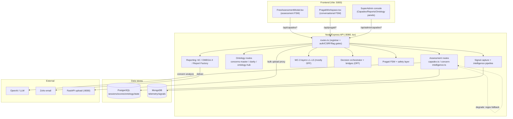
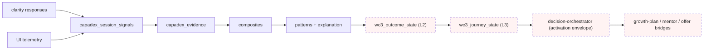
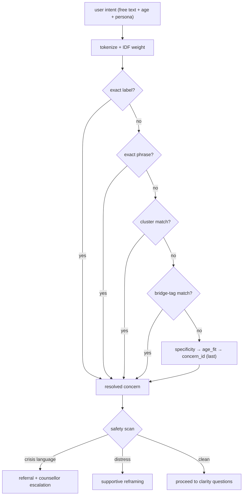
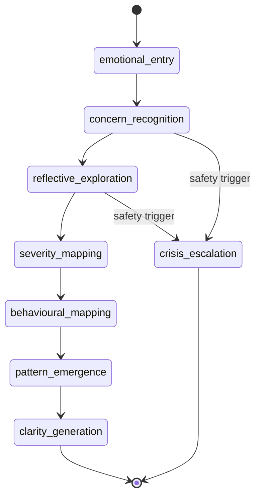
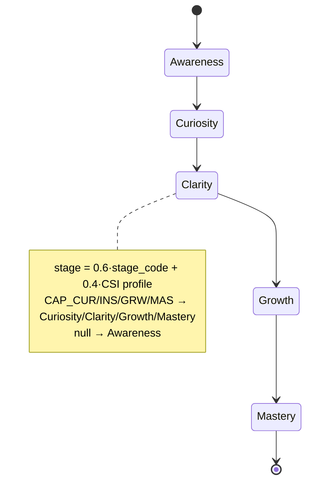

# MX-700 · PHASE 1 — CAPADEX Current State Discovery

> **Read-only deliverable. No code modified.** This is the "understand exactly what CAPADEX does today"
> artifact for the MX-700 re-architecture initiative. Endpoint/table inventories are derived from the
> route registration list (verified against `backend/routes.ts`), the feature-flag registry (verified),
> migrations, and service code. Where a specific path/column was inferred from a router rather than read
> line-by-line it is marked *(indicative)*. Honesty rule applies throughout: real ≠ scaffolded, null ≠ 0.

---

## 0. Executive summary

CAPADEX today is **not one product — it is a layered stack of ~8 sub-systems** that grew additively, each
behind its own feature flag:

1. **Assessment runtime** (the live, public, revenue-bearing core): concern intake → clarity questions →
   scoring → report.
2. **Behavioural ontology** (4-tier: domains → families → signals → atomic, ~16k leaf nodes) + concerns
   master (~2.5k) + clarity questions (~30k).
3. **Runtime intelligence spine** (signal capture → evidence → composites → patterns → outcome → journey).
4. **WC-3 intelligence layers** (L1 Stage, L2 Outcome, L3 Journey, L4 Personalization, L5A–D
   question/context/outcome/journey projections, longitudinal) — **almost entirely flag-OFF / offline**.
5. **Decision orchestration** (WC-6/WC-7B composer + bridges to growth-plan, mentor, subscription) —
   **flag-OFF, dormant**.
6. **Pragati** conversational runtime (13-state FSM + crisis/safety layer).
7. **PIL** (Problem Intelligence Layer) + knowledge graph (`pil_kg_*`).
8. **Reporting / commercial** (Dynamic Report Intelligence 6C, OMEGA-X, Report Factory, entitlement).

**The defining characteristic of the current state:** the *substrate is rich and largely real*, but the
*intelligence and decision layers are dormant* — **the vast majority of WC-3 / decision / outcome /
journey flags default OFF**, and several engines are **offline/audit-only (never wired into a request
path)**. What runs live for a normal user is essentially: **concern → clarity questions → score →
report**. Everything that would make CAPADEX a "decision engine" exists in code but is switched off.

**Business purpose:** CAPADEX is the behavioural-intelligence front door — a free/low-cost diagnostic
assessment that (a) gives the user a behavioural readout and (b) is the intended top-of-funnel into the
paid Career Builder / LBI / mentoring / subscription products. The strategic intent (MX-700) is to
promote it from "diagnostic that produces a report" to "adaptive decision engine that guides every user."

---

## 1. Business purpose & role in the platform

| Dimension | Current reality |
|---|---|
| **What it sells** | A behavioural diagnostic: user describes a concern → answers clarity questions → gets a 0–100 score, level band, sub-domain heatmap, pattern tags, and a report. Free intro tier + paid deeper reports (OMEGA-X / PDF) via entitlement. |
| **Funnel role** | Top-of-funnel acquisition + the behavioural signal source meant to feed Career Builder, LBI, mentoring and subscriptions. The *bridges* exist (growth-plan, mentor, offer) but are **flag-OFF**, so the funnel hand-off is not live. |
| **Audience** | Multi-persona: student / adult / parent (assessment side); employer / recruiter / mentor / institution (ecosystem side). |
| **Strategic gap** | CAPADEX produces a *report*, not a *decision + next best action*. The decision engine is built but dormant. |

---

## 2. Architecture overview

**Three runtime processes** (see workflows §7):
- **Node/Express API** (`backend/`, port 8080) — the CAPADEX brain: all assessment, ontology, intelligence,
  decision, Pragati, reporting routes. Runs on `tsx` (no compile/typecheck gate in prod).
- **FastAPI upload service** (`backend-main/`, port 8000) — bulk upload / heavy ingest; the Node API
  proxies to it via `FASTAPI_URL`.
- **React/Vite frontend** (`frontend/`, port 5000) — assessment modal, Pragati workspace, admin console;
  `/api/*` proxied to 8080.

**Shared Postgres** (`DATABASE_URL`) is the source of truth for all session state and scores.
**MongoDB** (`MONGODB_URI`) is used for high-volume telemetry/signals (fire-and-forget; non-blocking).
**OpenAI/LLM** powers concern analysis + narrative; **degrades to deterministic regex/static** when absent.
**Zoho** delivers report/OTP email; **degrades to in-app retrieval** when absent.



---

## 3. Services inventory (backend/services)

| Cluster | Key files | Role | Live? |
|---|---|---|---|
| **Assessment / scoring** | `concern-resolver-engine.ts`, `adaptive-assessment-engine.ts`, `adaptive-assessment.ts`, OMEGA-X scoring | Resolve concern, pick/adapt questions, score | **Live** (adaptiveQuestioning ON) |
| **Ontology** | `ontology-seed.ts`, signal/family/domain seeders, mapping engine, hub | 4-tier signal ontology + concerns + clarity | **Live data, admin-managed** |
| **Runtime spine** | `intelligence-pipeline.ts`, composite-signal-engine, pattern engine, behaviour graph, insight explainer | signal→composite→pattern→explanation | **Flag-gated** (runtimeIntelligence* OFF) |
| **WC-3 L1–L5** | `wc3/stage-intelligence.ts`, `outcome-intelligence.ts`, `journey-projection.ts`, `wcl-projections.ts`, `question-stage-intelligence.ts`, `trend-intelligence.ts` | Stage/outcome/journey/longitudinal intelligence | **Mostly OFF / offline** |
| **Decision** | `wc7b/decision-orchestrator.ts`, `growth-plan-bridge.ts`, `mentor-bridge.ts`, `decision-persistence.ts`, `wc7c/offer-engine.ts` | Compose decision + fan to destinations | **OFF, dormant** |
| **Persona / routing** | `experience-routing.ts`, `role-auto-resolution.ts`, `contextual-role-resolution-engine.ts` | Derive stage/persona, route to studio | **Live (career side)** |
| **Pragati / safety** | `routes/pragati.ts`, `safety-layer.ts` | Conversational FSM + crisis escalation | **Live** |
| **PIL** | `pil/*` (report-builder, prediction-engine, search-intent), `pil_kg_*` | Problem intelligence + KG | Flag-gated |
| **Reporting / commercial** | `pil/report-builder.ts`, Report Factory, entitlement/offer engines, `email.ts` | Reports + delivery + commerce | Mixed (reports live, commerce OFF) |

---

## 4. API inventory

**Verified router registration order** (from `backend/routes.ts`, all mounted on the `concernsPool`):

```
registerCapadexRoutes                 (core assessment)        ~L13901
registerCapadexRecommendationsRoute                            ~L13912
registerCapadexEnterpriseRoutes                                ~L13913
registerCapadexPaymentRoutes                                   ~L13914
registerCapadexQuestionsRoutes        (admin, super-admin)     ~L13916
registerCapadexOntologyRoutes         (admin)                  ~L13917
registerCapadexConcernsMasterRoutes   (admin)                  ~L13928
registerCapadexClarityQuestionsRoutes (admin)                  ~L13929
registerCapadexOntologyHubRoutes      (admin)                  ~L13930
registerCapadexCoverageRoutes         (admin)                  ~L13931
registerCapadexConcernSignalMapRoutes (admin)                  ~L13936
registerCapadexQuestionRegistryRoutes (admin)                  ~L13937
registerCapadexPredictionRoutes                               ~L13944
registerSignalCaptureRoutes                                    ~L13945
registerPragatiRoutes                                          ~L14160
registerOutcomeIntelligenceRoutes     (admin)                 ~L14195
```
Plus concern-intelligence, simulation, PIL-graph, coverage, question-registry routers.

**Representative endpoints** *(indicative paths; grouped by router)*:

| Router | Endpoint(s) | Auth | Flag |
|---|---|---|---|
| `capadex.ts` | `GET /api/capadex/concerns`; `POST /session/start`; `POST /session/:id/respond`; `POST /session/:id/complete`; `GET /session/:id/report`; `GET /session/:id/omega-x`; `GET /report/:id/pdf`; `POST /auth/login`; `GET /pricing` | public + `gateSessionEntitlement`/`gateReportEntitlement` on paid reads | core (always-on) |
| `capadex-concern-intelligence.ts` | `POST /concern/analyze`; `POST /concern/adaptive-next` | requireAuth | adaptiveQuestioning |
| `capadex-concerns-master.ts` | `GET/POST /api/admin/capadex/concerns-master`, `/import` | requireSuperAdmin | — |
| `capadex-clarity-questions.ts` | `GET /api/admin/capadex/clarity-questions`, `/import` | requireSuperAdmin | — |
| `capadex-ontology-hub.ts` | `GET …/ontology-hub/stats`, `/:resource` | requireSuperAdmin | — |
| `signal-capture.ts` | `POST /api/signals/ingest`, `/telemetry`; `GET /api/admin/signals/dashboard` | public ingest / admin read | DB-table flag `signal_intelligence` |
| `outcome-intelligence.ts` | `GET /api/outcome-intelligence/enabled`; `/overview`; `/ledger` | enabled=public probe; rest super-admin | outcomeIntelligenceActivation |
| `pragati.ts` | `POST /session/start`, `/:id/respond`, `GET /:id/resume`, `/flow-config`, `/ontology` + admin escalations | public session / admin | — |
| `capadex.ts` (decision composite) | `GET /api/capadex/session/:id/activation` (orchestrator), `/outcome`, `/journey` | requireAuth | decisionOrchestrator / wc3Outcome / wc3Journey (all OFF) |

**Registration-order quirk (carry-forward):** literal sub-paths (`/export.csv`, `/complete`) must register
before `/:id` param handlers or the param swallows them. CSRF-exempt regexes exist for
`/session/:id/complete` and report paths (lines ~416–418).

---

## 5. Database layer

### 5.1 Runtime spine (per-session execution chain)
```
capadex_session_signals → capadex_evidence → capadex_session_composites
  → capadex_session_patterns → wc3_outcome_state → wc3_journey_state
```
| Table | Purpose | Status |
|---|---|---|
| `capadex_sessions` / `_responses` / `_users` / `_otps` / `_reports` / `_runtime_sessions` | Live assessment session state, answers, users, OTP, generated reports | **Real / dynamic** |
| `capadex_session_signals` | Captured per-session signals (`session_id` is uuid) | Dynamic |
| `capadex_evidence` | Normalised evidence objects from answers/telemetry | Dynamic |
| `capadex_session_composites` | Higher-order composite signals | Dynamic (pipeline flag) |
| `capadex_session_patterns` | Explainable patterns (signal_refs/composite_refs/explanation) | Dynamic (pipeline flag) |
| `wc3_stage_state` / `wc3_outcome_state` / `wc3_journey_state` | WC-3 L1/L2/L3 per-session state | Dynamic **only when flags ON** (OFF today) |

### 5.2 Configuration / ontology (reference data)
| Table | Purpose | Status |
|---|---|---|
| `capadex_concerns_master` (~2.5k) | Authoritative concern taxonomy; `relational_bridge_tag` is the join key | **Real, populated** |
| `capadex_clarity_questions` (~30k) | Diagnostic item pool; joins via `master_bridge_tag` (bucket-level); `concern_id` is DISJOINT from master | **Real, populated** |
| `capadex_domains/families/signals/atomic_signals` (4-tier, ~16k atomic) | Signal ontology | **Real, populated** |
| `wc3_stage_definitions` (5 stages) / `wc3_outcome_models` (6–7) / `wc3_journey_routes` (5) | Seeded catalogs | **Real (seeded constants)** |
| `onto_domains/families/competencies/roles/dna_profiles/role_weights` | Competency genome + Role-DNA | **Real (mix curated + O*NET-derived)** |
| `pil_kg_*` | Problem Intelligence knowledge graph | Flag-gated; ⚠️ namespace `pil_kg_*` NEVER bare `kg_*` (collision wipes live graph) |

**Schema management:** no central migration runner — most tables have a migration file AND a lazy
`ensure*Schema()` (CREATE TABLE IF NOT EXISTS) that mirrors it. **Existence ≠ population** — the ontology
auto-creates via shared `ensureSignalOntologySchema` but still needs manual seed.

**Critical honesty trap:** there are **two distinct feature-flag systems** — the file registry
`config/feature-flags.ts` (gates routes/UI) AND a DB table `feature_flags` (gates `/api/signals/ingest`
and engine flags). If signal tables look empty, check the DB table first.

---

## 6. Decision / state / data flow diagrams

### 6.1 Sequence — live assessment flow (what actually runs today)
```mermaid
sequenceDiagram
  participant U as User
  participant FE as FreeAssessmentModal
  participant API as Node API (:8080)
  participant LLM as OpenAI (optional)
  participant DB as PostgreSQL

  U->>FE: describe concern (free text)
  FE->>API: POST /concern/analyze
  API->>LLM: resolve concern → canonical id
  alt LLM unavailable
    API->>API: resolveCapadexConcern (regex/IDF fallback)
  end
  API-->>FE: resolved concern + clarity preview
  FE->>API: POST /session/start
  API->>DB: create capadex_session
  loop each clarity question
    FE->>API: POST /session/:id/respond
    API->>DB: persist response (+ signal capture)
    API->>API: adaptive decideNext (escalate/deescalate/probe)
    API-->>FE: next question
  end
  FE->>API: POST /session/:id/complete
  API->>DB: score (0–100), level band, heatmap, patterns
  API-->>FE: result card
  FE->>API: GET /session/:id/report (entitlement-gated)
  API->>DB: read report; (Zoho email if configured)
  API-->>FE: full report
```

### 6.2 Data flow — signal → decision (most of this is flag-OFF today)

> Dashed/pink = **flag-OFF or offline today**. Live path stops at `patterns`; everything downstream
> (outcome → journey → decision → NBA) is dormant.

### 6.3 Decision flow — concern resolution cascade (live)


### 6.4 State flow — Pragati conversational FSM (live)


### 6.5 State flow — behavioural stage progression (WC-3 L1, flag-OFF)


---

## 7. Workflows

| Workflow | Command | Role for CAPADEX |
|---|---|---|
| **Backend API** | `cd backend && … (≈70 FF_* env flags) npm run dev:server` | Runs the entire CAPADEX brain. **Note:** the workflow command turns ON many `FF_*` flags via env that default OFF in the file registry — so the *live* dev posture ≠ the file-registry defaults (important for any audit measuring "what's on"). |
| **Start application** | `cd frontend && npm run dev` | Serves the assessment + admin UI |
| **Upload Service** | `cd backend-main && uvicorn app.main:app --port 8000` | FastAPI bulk upload; Node proxies via `FASTAPI_URL` |
| build / isolation / live-avatar-* / voice-screening-* | various | test + build workflows (not CAPADEX runtime) |

**Key nuance:** flag posture is set in **two places** — file defaults (`config/feature-flags.ts`) AND the
Backend API workflow env. A flag can read OFF in the file but be ON in the running server. Any "what's
activated" claim must be measured against the **live workflow env**, not the file defaults.

---

## 8. Feature flags (CAPADEX-relevant posture)

**Default ON (file registry):** `adaptiveQuestioning`, `validationLoop`, `memoryIntelligence`, the
`*V2` competency/runtime cluster, `ucipEnabled`/`ucipShadowMode`, `adaptiveIntelligenceFoundation`,
`employabilityPassport`, `careerBuilderSuite`, `careerOutcomeEvidence`.

**Default OFF (the entire decision/intelligence frontier):** `wc3Stage`, `wc3Outcome`, `wc3Journey`,
`wc3Personalization`, `wc3Longitudinal`, `wc3QuestionIntel`, `wc3ContextIntel`, `wc3OutcomeCrosswalk`,
`decisionOrchestrator`, `journeyGrowthPlanBridge`, `decisionMentorBridge`, `decisionPersistence`,
`runtimeIntelligenceActivation`/`Pipeline`/`Consumption`, `outcomeIntelligenceActivation`,
`forecastIntelligence`, `interventionIntelligence`, `careerIntelligence*`, and the whole `commercial*`
family (entitlement/enforcement/metering/recurring/upsell/renewal).

> **The single most important flag finding:** *"CAPADEX as a decision engine" is already coded but
> shipped OFF.* The re-architecture is less about building net-new intelligence and more about
> **activating, reconciling, and making-explainable** what is dormant — behind the same flag discipline.

---

## 9. Persona logic

- **Personas:** `student`, `adult`, `parent`, `employer`, `mentor`, `recruiter`, `institution`.
- **Detection:** platform `role` is primary; `experience-routing.ts deriveStage()` refines via `yearsExp`,
  seniority regex ("VP"/"Chief"), and work-experience presence → career stages (`student`, `graduate`,
  `early/mid/senior`, `executive`).
- **Routing:** `effectiveExperience` sends users to Launchpad (fresher) / Command Center (mid) /
  Leadership-Executive Studio (senior). **Experience switch is a navigation PREFERENCE — it must never
  mutate the canonical stage** (carry-forward trap).
- **Assessment-side persona/age routing:** concern resolution filters the corpus by `primary_persona`
  (SOFT — ~63% provider-only families) + age (HARD `age_min`/`age_max`). Derive adultness from age (≥24),
  not persona key alone, or empty-persona adults mis-route to student banks. Recover clarity-row
  age/persona via the **bridge tag**, not `concern_cluster`.

---

## 10. Conditional rules (live)

- **Concern resolution cascade** (§6.3): IDF-weighted match is PRIMARY rank; the cascade only breaks ties;
  `concern_id` is the LAST resort. Short-intent drops the 60% gate.
- **Clarity picker:** 3-tier `pickQuestionsFromMaster → pickQuestionsFromDB → static`, carrying
  `clarity_source` provenance; `resolveCapadexConcern()` keyword fallback → never 404s.
- **Orphan/fallback rules:** empty-spine concerns get ONE low-confidence general-support insight built
  read-only at `/explain` (never seeded — can't inflate composites). Off-topic clarity Qs usually = an
  orphan bridge tag mis-remapped by a greedy keyword rule → hand-verified override.
- **Safety/crisis (Pragati):** `safety-layer.ts validateNarrative()` — REFERRAL (self-harm language →
  counsellor escalation), SUPPORTIVE (distress → reframing), plus shame-language sanitization and
  diagnostic-label removal.

---

## 11. Adaptive logic (live)

`adaptive-assessment-engine.ts decideNext()`:
- **Consistency probe** when `contradiction_count ≥ 2`.
- **De-escalate** difficulty when `rolling_confidence < 0.45`.
- **Escalate** when `streak_high ≥ 3` and `rolling_score ≥ 80`.
- **Depth expansion** (e.g. Leadership `LEA`): `rolling_score ≥ 75` → `depth_band standard → deep`.

**Honest ceiling (carry-forward):** the live served clarity bank is ~100% "medium" difficulty, so
*served* difficulty can't actually shift even when the engine decides to escalate — target/readiness
thresholds move, the item difficulty does not. This is an authoring gap, not a logic bug.

---

## 12. Progression / stage model

- **Canonical 5-stage** (WC-3 L1): Awareness(0.25) → Curiosity(0.50) → Clarity(0.75) → Growth(1.00) →
  Mastery(1.25). `resolveSessionStage = 0.6·stage_code + 0.4·CSI`.
- **3 overlapping taxonomies** (THE core debt): 5-stage backend, 4-code `CAP_*` (frontend), 3-stage in
  older report pages. **Inconsistent — must be reconciled before keying user-facing decisions to stage.**
- **Question-level stage (L5A):** derived (not read from the dead `stage` column) by weighted vote over
  `question_type`/`response_type`/`narrative_style`/`polarity`; legitimately skews Clarity(~56%)/
  Growth(~30%), Mastery rare (~0.4%) — an authoring property, not a bug.

---

## 13. Reports

| Report system | What it produces | Status |
|---|---|---|
| **Assessment report** | 0–100 score, level band (Emerging/Developing/Proficient/Advanced), sub-domain heatmap, pattern tags; free result card → entitlement-gated full report → PDF | **Live** |
| **OMEGA-X** | Report quality / validation score (completeness, consistency, anchor alignment, contradiction detection) | Live (paid read) |
| **Dynamic Report Intelligence (6C)** | Stakeholder reports across 6 quality axes | Flag-gated (`reportFactory` OFF) |
| **Report Factory** | Admin template/narrative engine, white-label export (pdfkit, `/tmp/rf_exports`) | Flag-gated; zero rows in dev = honest |
| **WC-3 reports** | Longitudinal / outcome / journey reports | Flag-OFF / offline |

**Preview ↔ report share ONE visual canon** (hopeful/light tone; header/CTA deep enough for white text).
**Email:** Zoho; `X-Preview-Subject` header must be `encodeURIComponent` (ASCII-only headers). All
user/AI-authored interpolation is HTML-escaped (XSS).

---

## 14. Dependencies & degradation

| Dependency | Used for | Degradation when absent |
|---|---|---|
| **PostgreSQL** | All session state + scores (source of truth) | **Hard stop** — assessment cannot proceed |
| **OpenAI / LLM** | Concern analysis, narrative, Pragati reflections | Falls back to deterministic regex/IDF resolver + static templates; AI paths emit null (never 0) |
| **MongoDB** | Telemetry / signal volume | Bypassed (fire-and-forget); core scores unaffected |
| **Zoho email** | Report + OTP delivery | Reports remain accessible in "My Sessions"; dev MFA code logged to workflow console |
| **FastAPI (:8000)** | Bulk upload / ingest | Uploads fail; assessment unaffected (proxied only via `FASTAPI_URL`) |

---

## 15. Honest findings (for MX-700 Phase 2+)

1. **The decision engine is built but OFF.** The biggest single fact: outcome/journey/decision/NBA all
   exist in code and default OFF. Re-architecture ≈ activate + reconcile + make-explainable, not greenfield.
2. **Stage taxonomy is split 3 ways** — the #1 structural debt blocking any stage-keyed UX.
3. **Several engines are offline-only** (L5C/L5D projections, longitudinal) — never read by a request path.
4. **Coverage ceilings are real and honest** (journey ≈ outcome ≈ 80%; served difficulty flat;
   mentoring = universal low-confidence fallback). Do not "fix" these by fabrication.
5. **Two flag systems + workflow-env override** mean "what's on" must be measured live, not from defaults.
6. **Funnel hand-off bridges are dormant** (growth-plan/mentor/offer) — CAPADEX does not yet drive
   downstream products at runtime.
7. **Cross-server seam:** intelligence + M5 in `backend/`; mentoring + richer subscription SQL in
   `frontend/server/` — a decision engine must resolve this seam to reach those destinations.

---

## 16. What I did NOT do
- No code changed, no flags flipped, no schema migrations, no deploy. Discovery only.

**→ Phase 1 complete. Awaiting Founder review before Phase 2 (gap analysis / target architecture).**
This supersedes the earlier `backend/audit/capadex-phase-3/blueprint.md` as the canonical starting point;
that draft's recommendations fold into Phase 2.
