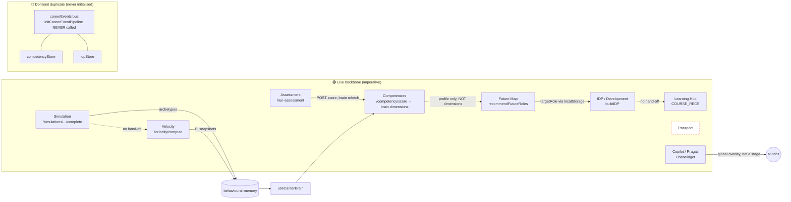

# Career Builder — Architecture & Dependency Map

**Date:** 30 May 2026
**Scope:** Every Career Builder tab in `frontend/src/pages/CareerBuilderPage.tsx` (~7945 lines) + its tab components, engines, stores, services, and backend hand-offs.
**Method:** 3 parallel code explorers, then **contested wiring claims re-verified by direct grep** (the event-pipeline "wiring" reported by exploration is in fact dormant — corrected below).
**Constraint honoured:** Analysis only. **No code was modified.**

### Legend
- 🟢 **WIRED** — real data passes at runtime.
- 🔴 **BROKEN** — code references a producer that is dormant/dead at runtime (exists in source, never executes).
- ⚪ **MISSING** — no connection exists between two stages that the roadmap implies should connect.
- 🟡 **DUPLICATE** — two parallel paths compute/carry the same thing.
- 🔵 **STAGED** — intentionally built-but-not-yet-consumed groundwork (not a defect).

---

## 0. The Single Most Important Finding

There are **two parallel wirings** of the Career Builder, and only one of them runs:

| Backbone | Mechanism | Status |
|---|---|---|
| **A — Live (imperative)** | `useCareerBrain()` fetches APIs on mount + **direct synchronous engine calls** in the page (`recommendFutureRoles`, `buildIDP`, `computeFitment`, `switchability`) via `useMemo`. | 🟢 Runs |
| **B — Designed (reactive)** | `careerEvents.ts` event bus (`ASSESSMENT_SUBMITTED → COMPETENCY_RECALCULATED → FUTURE_ROLES_RECOMPUTED → idpStore.build()`) driving Zustand stores (`competencyStore`, `idpStore`). | 🔴 Dormant |

**Verified:** `initCareerEventPipeline` is **never called** anywhere in `frontend/src`; the dispatchers are only re-exported in the barrel; `competencyStore` and `idpStore` have **no UI subscribers** — they are referenced only by the dormant pipeline. Backbone B is a complete, parallel, non-functional copy of Backbone A → the platform's single largest **DUPLICATE**.

> Practical consequence: any future "make tabs react to each other automatically" work must pick ONE backbone. Today only direct calls + `localStorage` hand-offs connect the stages.

---

## 1. Tab Inventory (24 functional tabs · 5 zones · + 6 Adaptive routes)

| Zone | Tabs |
|---|---|
| **Command center** | dashboard · weekly-plan · next-actions |
| **Profile studio** | profile · resume · skills |
| **Intelligence hub** | assessment · future-map · pathways · simulations · market-intel · velocity · workforce |
| **Execution engine** | jobs · interview · visibility · mentors · goals · development (IDP) · learning · fresher-hub |
| **Growth & memory** | behavioral-growth · career-memory |
| **Adaptive** (all route to `dashboard` with a `screen=` param) | ontology-explorer · benchmark-dashboard · career-mobility · trajectory-dashboard · workforce-insights · enterprise-workforce-os |

**Live data backbone — `useCareerBrain(userId,{profile,jobs,goals,eiScore})`** fetches:
`GET /api/competency/score/:userId` · `GET /api/career/behavioural-memory/:userId` · `GET /api/career/behavior-profile/:userId` · `fetchBehaviorGraph(userId)` (🔵 staged) → produces the `brain` object consumed by Command/Growth tabs.

---

## 2. Per-Tab Data Flow

### Command center
| Tab | Inputs | Outputs | Dependencies | Consumed Intelligence | Generated Intelligence |
|---|---|---|---|---|---|
| **dashboard** | profile, eiScore, eiBreakdown, jobs, goals | KPI tiles, Pragati daily brief | `useHybridEI`, `usePeerBenchmark`, `careerIntelligence.ts` | eiScore, peer percentile | surfaced concern flags (gap-derived) |
| **weekly-plan** | `brain`, openJobs, hasAssessment | execution roadmap | `WeeklyActionPlanTab`, `weeklyActionEngine.ts` | brain.weeklyFocus, fastestWinAction, executionStyle | ≤5 ROI-ranked weekly tasks (deep-linked) |
| **next-actions** | `brain`, openJobs, hasAssessment | task cards → LS `mx-career-idp-progress` | `NextBestActionsTab` | brain.skillGaps, riskFactors, coreBottleneck | prioritised action list |

### Profile studio
| Tab | Inputs | Outputs | Dependencies | Consumed | Generated |
|---|---|---|---|---|---|
| **profile** | profile, userId | `PUT /api/cv/profile/:userId` | ProfileTab | completeness % | raw evidence for EI/brain |
| **resume** | profile, userId | `POST /api/cv/parse`, `POST /api/cv/save-profile` | ResumeStudio, ResumeUploadBlock | — | extracted skills + history |
| **skills** | profile, `INDUSTRY_BENCHMARKS` | `PUT /api/cv/profile/:userId` (skills) | catalogs | industry demand % | competency radar (skill-count derived) |

### Intelligence hub
| Tab | Inputs | Outputs | Dependencies | Consumed | Generated |
|---|---|---|---|---|---|
| **assessment** | userId, profile, role/industry options | `POST /api/competency/profile`, `/run-assessment`, `POST /api/career/assessment/snapshot`, `PATCH /api/cv/profile` | `AdaptiveAssessmentRuntime`, `assessmentOptionsService`, `assessmentSelector` | COMPETENCY_DOMAINS | computedScore, percentile, gapAnalysis, roleFit |
| **future-map** | profile, `brain.behaviorProfile`, MARKET_CATALOG | LS `mx-career-target-role` (via `useTargetRole`) | `recommendFutureRoles` (`careerIntelligence.ts`) | marketReadiness, fitScore, demandScore, **behaviorProfile** | demand×switchability×fit bubble map; **selected targetRole** |
| **pathways** | profile | trajectory viz | `CAREER_DOMAINS` catalog | — | — |
| **simulations** | profile, eiScore | sim sessions → `POST /api/career/simulations/session/.../complete` | `SimulationsTab`, `scenarioEngine`, `behavioralSignalEngine` | profile | behavioural archetypes / leadership signals (→ behavioural-memory) |
| **market-intel** | profile, eiScore | trends/salary render | `MarketIntelTab`, `marketCatalog` | market catalog | — |
| **velocity** | profile, userId | `POST /api/career/velocity/compute`, `POST /api/career/memory/snapshot` | `CareerVelocityTab` | EI snapshots over time | velocity gauge, momentum drivers |
| **workforce** | profile, eiScore | aggregate views (admin) | `WorkforceTab`, `workforceStore`, `enterpriseIntelligenceEngine` | workforceStore | org capability heatmap |

### Execution engine
| Tab | Inputs | Outputs | Dependencies | Consumed | Generated |
|---|---|---|---|---|---|
| **jobs** | jobs, userId, profile, behavior | `GET/POST/PUT/DELETE /api/cv/jobs` | `FitmentInsightsPanel`, `rankJobsForUser` | fitment scores | application-velocity signals |
| **interview** | profile, behavior; LS bookmarks/answers | LS writes | `INTERVIEW_QS` catalog | **behavior.interviewReadiness** (CAPADEX) | readiness self-score |
| **visibility** | profile, eiScore; LS toggle | LS | `computeVisibility`, `estimateRecruiterViews` | eiScore | visibilityScore, band, recruiter-view estimate |
| **mentors** | profile; `MENTORS` catalog | request state | catalog | profile skills | networking-intent signals |
| **goals** | goals, userId | `POST/PUT/DELETE /api/cv/goals` | `GOAL_CATEGORIES` | milestones | direction/intentionality |
| **development (IDP)** | profile, behavior, MARKET_CATALOG; LS `mx-career-target-role`, `mx-career-idp-progress` | LS progress | `buildIDP`, `computeFitment`, `switchability` | **targetRole (from Future Map LS)**, behavior | eiLift projection, gap-closure roadmap |
| **learning** | profile; `COURSE_RECS` | LS `mx-learning-saved` | catalog | profile.skills | learning-priority signals |
| **fresher-hub** | profile; LS drives/projects/checklist | LS | `APTITUDE_BANK`, `GUIDE_SECTIONS` | profile completeness | fresher readiness index |

### Growth & memory
| Tab | Inputs | Outputs | Dependencies | Consumed | Generated |
|---|---|---|---|---|---|
| **behavioral-growth** | `brain` | radar + constraint breakdown | `BehavioralGrowthTab`, `useCareerBrain` | brain.behaviorProfile (CAPADEX) | longitudinal behavioural trend view |
| **career-memory** | userId, `brain` | timeline render | `CareerMemoryTab`, `useCareerBrain` | brain.signals, brain.patterns | historical EI trajectory view |

### Adaptive routes (re-route to `dashboard` + `screen=`)
ontology-explorer (`useCompetencyRuntimeStore`) · benchmark-dashboard (`benchmarkStore`) · career-mobility (`computeFitment`, targetRole) · trajectory-dashboard (`intelligenceStore`/longitudinal-engine) · workforce-insights (`workforceStore`) · enterprise-workforce-os (`enterpriseIntelligenceEngine`).

---

## 3. Dependency Graph (roadmap chain)

---

## 4. Link Status — Broken / Missing / Duplicate

### 🔴 BROKEN (source exists, never runs)
| Link | Why |
|---|---|
| `careerEvents` reactive pipeline (Assessment→Competency→FutureMap→IDP) | `initCareerEventPipeline` **never called** → the whole event bus is dormant. Stages connect via direct calls + LS instead. |
| `competencyStore` → UI | No component subscribes; only the dormant bus calls `.compute()`. |
| `idpStore` → UI | No component subscribes; only the dormant bus calls `.build()`. The live IDP tab uses `buildIDP()` directly. |

### ⚪ MISSING (roadmap implies a link that doesn't exist)
| Link | Detail |
|---|---|
| **Competencies → Future Map** | `recommendFutureRoles(profile, n, behavior)` consumes **profile + behaviorProfile only** — it does **not** read the competency score/dimensions. Competency intelligence does not drive future-role fitment. |
| **IDP → Learning** | Learning Hub filters `COURSE_RECS` by `profile.skills`; it ignores the IDP's gap roadmap. The two never talk. |
| **Simulation → Velocity** | Simulations write behavioural archetypes to behavioural-memory; Velocity computes from EI snapshots. No hand-off. |
| **Simulation → IDP / brain** | Simulation output is stored but not consumed by IDP, weekly-plan, or next-actions. |
| **Passport (stage 8)** | **No component exists** — no `Passport*` file, no tab. Roadmap P7 not built. |
| **behaviorGraph → any tab** | 🔵 `brain.behaviorGraph` (P2) has 0 tab consumers — *intentional staged groundwork*, not a defect. |

### 🟡 DUPLICATE (two paths for one thing)
| Duplicate | Paths |
|---|---|
| **Whole reactive backbone** | Live direct-call/`useCareerBrain` path **vs** dormant `careerEvents`+stores path (§0). |
| **Competency compute** | `useCareerBrain` fetch `/api/competency/score` **vs** `competencyStore.compute()`. |
| **IDP build** | page `buildIDP()` **vs** `idpStore.build()`. |
| **Future-roles recompute** | page `recommendFutureRoles()` **vs** `FUTURE_ROLES_RECOMPUTED` event. |
| **Velocity engine** | backend `/api/career/velocity/compute` (live) **vs** frontend `learningVelocityEngine.ts` (type-only orphan, referenced only by `transformationService`/`TransformationDashboard`). |
| **Behavioural source** | `behaviorProfile` (`/behavior-profile`, 5 readiness scalars, live) **vs** `behaviorGraph` (`/behavior-graph`, full graph, staged) — overlapping sources to reconcile in P3+. |

### 🟢 WIRED (confirmed live)
Assessment → Competencies (POST + brain refetch) · Future Map → IDP (targetRole via `localStorage`) · Velocity (backend compute + snapshots) · Copilot = `ChatWidget`/Pragati (global overlay via `GlobalChatMount`, `mx-open-*` events — not a linear stage).

---

## 5. Roadmap-Stage → Reality Map

| Roadmap stage | Actual implementation | State |
|---|---|---|
| Assessment | `assessment` tab + `/api/competency/run-assessment` | 🟢 |
| Competencies | competency score → `brain.dimensions`; `skills` radar; ontology-explorer | 🟢 (but downstream under-consumed) |
| Future Map | `future-map` tab | 🟢 (consumes profile+behavior, not competency) |
| IDP | `development` tab (`buildIDP`) | 🟢 |
| Learning | `learning` tab | 🟢 standalone (⚪ not fed by IDP) |
| Simulation | `simulations` tab | 🟢 standalone (⚪ output not consumed) |
| Velocity | `velocity` tab (`/velocity/compute`) | 🟢 |
| **Passport** | — | ⚪ **not built (P7)** |
| **Copilot** | `ChatWidget`/Pragati overlay | 🟢 exists, ⚪ not a career-stage node (P8) |

---

## 6. Headline Takeaways
1. **One dead twin backbone.** The reactive `careerEvents`+stores architecture is a fully-built duplicate that never initialises; everything actually runs on direct calls + `localStorage`. Pick one before adding cross-tab reactivity.
2. **Competency intelligence under-propagates.** It populates the brain but does **not** drive Future Map fitment — a missing high-value link.
3. **Three "islands."** Learning, Simulation, and (future) Passport are functional but disconnected — they neither consume upstream gaps nor feed downstream stages.
4. **Passport is the only entirely absent stage;** Copilot exists but only as a global overlay, not a pipeline node.
